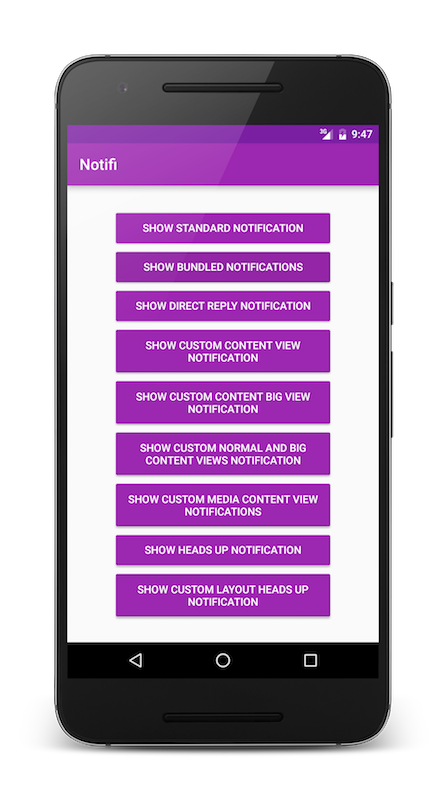
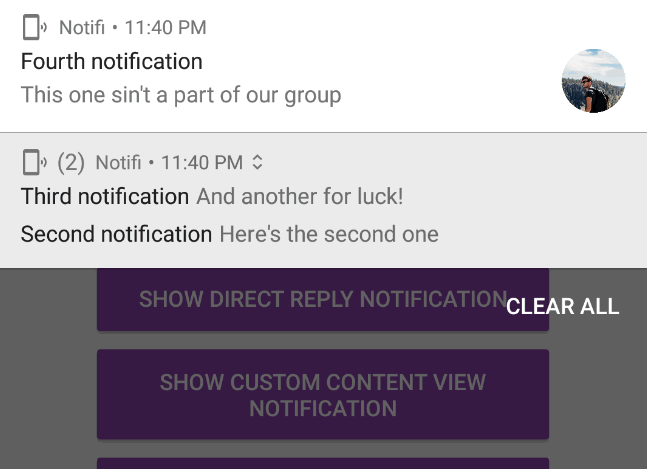
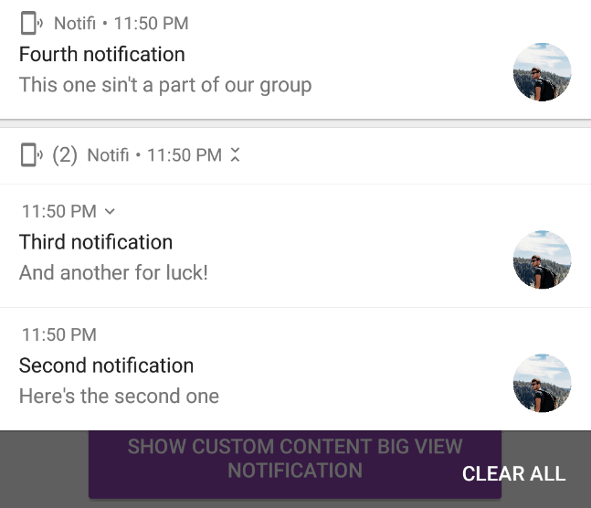
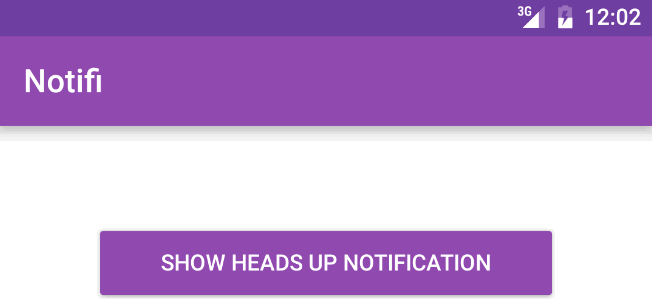
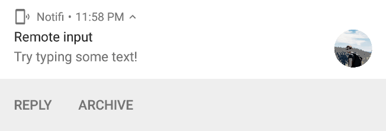
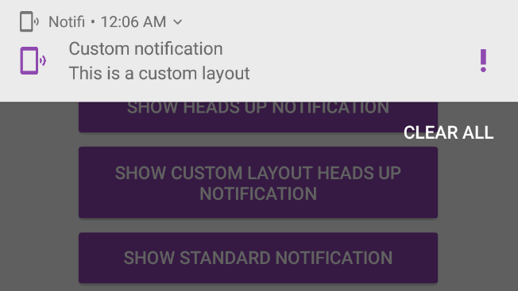

# Notifi
========

A sample app demoing the awesome new Android N notification features. Simply hit a button on the main screen and the desired notification will appear!

<p align="center">
    
</p>

#Notification Demos

In this application you can demo notifications for:

Standard Notifications
======================

Standard system notifications using the new templates used in Android N.

<p align="center">
    
</p>

Bundled Notifications
=====================

Bundled notifications that appear grouped when a group ID has been set for each notification.

<p align="center">
    
</p>

We can also display actions for notifications that are bundled.

<p align="center">
    
</p>

Heads Up Notifications
======================

Heads-up notifications appear above the users current activity, provided the screen is on. As of andorid N, we can now use custom layouts for these notifications.

<p align="center">
    
</p>

Direct Reply Notification
=========================

Direct-reply notifications allow us to provide user input from a notification. We can then retrieve this input from the launched intent.

<p align="center">
    
</p>


Custom View Notifications
=========================

We can now use custom views for notifications as of Android N. These can be for both collapsed and expanded notification layouts:

<p align="center">
    
</p>


Requirements
------------

To compile and run the project you'll need:

- [Android SDK](http://developer.android.com/sdk/index.html).
- Android [N (API 24) ](http://developer.android.com/tools/revisions/platforms.html#5.1).
- Android SDK Tools
- Android SDK Build tools 24.0.0 rc1
- Android Support Repository
- Android Support libraries
- JDK 8

#Building

To build, install and run a debug version, run this from the root of the project:

```./gradlew assembleDebug```
